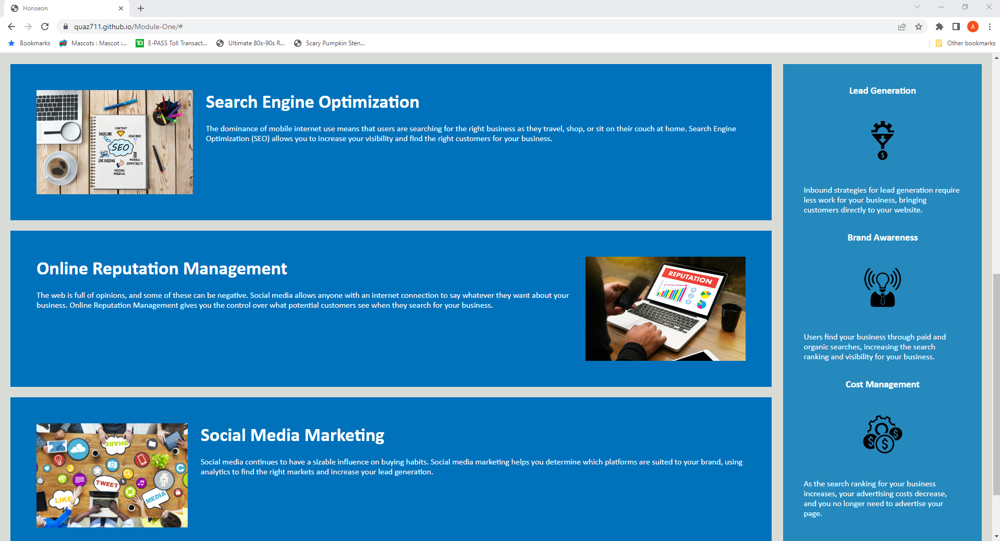

# CodeRefactor

## A webpage that meets accessibility standards

A marketing agency wants a codebase that follows accessibility standards so that their site is optimized for search engines

## View the source code; Update HTML to semantic elements

* Upon first look of the HTML code there were no semantic elements. I removed div and some classes that were not needed to add semantic 
elements such as header, section, article, aside, and footer.

## View the structure of the HTML elements; Follows a logical structure independent of styling and positioning

* Upon first look of the HTML and CSS code some indentation seemed out of order and lines ran off the coding screen so some organizing 
and comments were made to make it clearer to read and comprehend.

## View image elements; Accessible alt attributes

* Upon first look of the HTML there were no alt attributes, so alt attributes were added describbing the images in the event they did not load.

## View heading attributes; They fall in sequential order

* Link to CSS file was put below the title declaration.

## View title element; Find it has a concise and descriptive title

* Changed the original title "website" to "Horiseon" to reflect the company.

## Additional added items for accessibility

* Added link to top of page to heart icon on bottom of page
* Added link to top of page to Search Engine Optimization image
* Added link to top of page to Online Reputation Management
* Added link to top of page to Social Media Marketing

# Links to deployed application

## GitHub repository for Challenge One
[Github Repo](https://github.com/Quaz711/Module-One.git)

## Live website for Challenge One
[Live Website](https://quaz711.github.io/Module-One/)